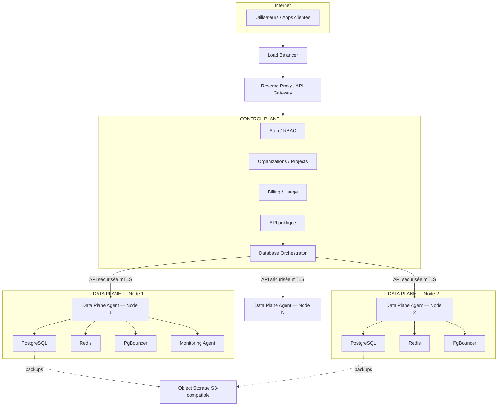
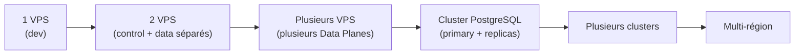
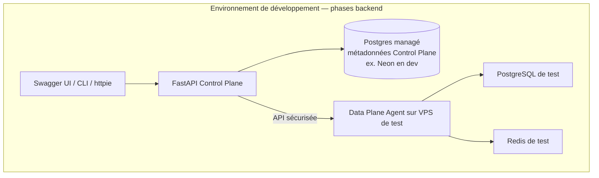

# 01 — Architecture globale

## 1.1 Vue d'ensemble

Le Reverse Proxy / API Gateway et le Load Balancer sont volontairement représentés
séparément du Control Plane : ce sont des composants d'infrastructure partagée, pas
des services applicatifs. En développement (1 VPS), ils peuvent être un simple
Traefik/Nginx ; en production, ils deviennent un vrai LB managé ou HAProxy/Traefik en
cluster.

## 1.2 Composants et responsabilités

### Control Plane
Cerveau administratif. Ne stocke **que des métadonnées** : qui existe, quoi existe, où
ça se trouve, quel est son état. Ne contient jamais les données métier des clients
(pas de tables clientes, pas de contenu de leurs bases).

Sous-composants :
- **Auth Service** — comptes, sessions, MFA, API keys.
- **Organization/Project Service** — tenants, projets, memberships, RBAC.
- **Database Registry** — métadonnées des bases (état déclaré/observé), pas les données.
- **Database Orchestrator** — décide *où* et *comment* provisionner (détaillé en [03](03-database-orchestrator-et-agent.md)).
- **Billing/Usage Service** — plans, quotas, metering, facturation.
- **Audit Service** — journal immuable des actions sensibles.
- **Job/Queue Service** — exécution asynchrone des opérations longues.

### Data Plane
Exécute réellement les charges de travail des clients : PostgreSQL, Redis, PgBouncer,
agents de supervision et de sauvegarde. Un Data Plane est identifié par un `node_id`
et rattaché à une `region_id` et, à terme, à un `cluster_id`.

### Database Orchestrator
Service du Control Plane (logiquement séparé, déployable indépendamment) qui pilote
le cycle de vie complet d'une base : placement, provisioning, resize, failover,
migration, suppression. Ne touche jamais directement PostgreSQL — il parle au **Data
Plane Agent** via une API sécurisée.

### Data Plane Agent
Processus qui tourne sur chaque nœud du Data Plane. C'est la seule entité autorisée à
exécuter des commandes locales (créer une base, créer un rôle, redémarrer PgBouncer,
lire les métriques système). Le Control Plane ne se connecte jamais en SSH root
« à la main » sur un nœud pour une opération métier — tout passe par l'agent, ce qui
garde une frontière d'autorité claire et auditable.

### Customer Database
Une base PostgreSQL appartenant à un client, hébergée sur un cluster PostgreSQL d'un
node du Data Plane. Ce n'est ni une ligne, ni un schéma du Control Plane.

## 1.3 Pourquoi cette séparation est non négociable

Si le Control Plane et le Data Plane sont fusionnés (ex : le Control Plane exécute lui
même `CREATE DATABASE` en local), alors :
- impossible d'ajouter un deuxième serveur sans réécriture ;
- impossible d'isoler un client à un niveau infrastructure ;
- une panne applicative du Control Plane peut faire tomber les bases clientes ;
- aucune notion de placement, donc aucun scaling horizontal réel.

La séparation Control/Data Plane est ce qui permet la trajectoire de croissance
ci-dessous **sans refonte**.

## 1.4 Trajectoire d'évolution infrastructure

Ce que le code ne doit **jamais** supposer, à n'importe quelle étape :
- qu'il n'existe qu'un seul `node_id` ;
- que `node_id` = `cluster_id` (un cluster peut avoir plusieurs nodes : primary + replicas) ;
- que toutes les bases d'un client sont sur le même node ;
- qu'une région ne contient qu'un node.

Toute requête de placement, de connexion ou de résolution d'un endpoint doit **toujours**
passer par les métadonnées (`database_id` → `node_id`/`cluster_id` → `region_id` →
`endpoint`), jamais par une constante en dur.

## 1.5 Environnement de développement (Phase 1-11 — backend uniquement)

> **Décision de séquencement (2026-09-18)** : le backend FastAPI est développé et
> stabilisé dans son intégralité (Phases 1 à 11) avant que le moindre travail Next.js
> ne démarre. Next.js n'apparaît qu'en Phase F (cf.
> [09-plan-de-phases.md](09-plan-de-phases.md#phase-f--frontend--dashboard-nextjs)).
> Pendant toutes les phases backend, la validation se fait via Swagger UI (généré par
> FastAPI), la CLI, et des clients HTTP (curl/httpie/Postman) — pas d'interface
> graphique.

Règle 19 rappelée : Neon (ou tout Postgres managé tiers) n'héberge **que** les
métadonnées du Control Plane pendant le développement, jamais les bases des clients.
Dès la Phase 2, un vrai VPS avec un Data Plane Agent doit exister, même en un seul
exemplaire, pour valider le provisioning réel.

## 1.6 Stack technique retenue

Conforme à la proposition du cahier des charges (§53), sans changement injustifié :

| Couche | Choix | Justification |
|---|---|---|
| API Control Plane | Python + FastAPI | async natif, typage Pydantic, OpenAPI auto-généré (exigence §33) |
| Base de métadonnées | PostgreSQL (Neon en dev, self-hosted en prod) | cohérence avec le reste de la stack, JSONB pour les champs semi-structurés (ressources, policies) |
| Files/Jobs | Redis + Arq (ou Celery) | Redis déjà requis pour cache/queues (§27), Arq est async-natif et s'intègre bien à FastAPI |
| Frontend | Next.js + TypeScript | SSR pour dashboard, écosystème mature |
| Data Plane Agent | Python (FastAPI léger) ou Go | Python en Phase 2 pour vélocité et cohérence avec le reste du code ; réévaluation vers Go possible en Phase 6+ si le besoin de faible empreinte mémoire par node se confirme — **décision différée, documentée ici pour ne pas être oubliée** |
| Connection pooling | PgBouncer | standard de facto, supporté par tous les hébergeurs VPS |
| Object Storage | S3-compatible (MinIO en dev, S3/Backblaze/Scaleway en prod) | portabilité multi-fournisseur |
| Monitoring | Prometheus + Grafana + Loki | stack standard, agents disponibles pour PostgreSQL et système |
| Orchestration containers | Docker Compose (Phase 0-6), Kubernetes envisagé Phase 7+ | Compose suffit tant que le nombre de nodes reste gérable manuellement ; K8s apporte de la valeur seulement à partir du multi-node/multi-cluster réel |
| Reverse proxy | Traefik | découverte de service dynamique, intégration Let's Encrypt native, utile dès qu'on a plusieurs Data Plane Agents à exposer en mTLS |

Aucun changement de stack n'est proposé à ce stade : le choix du cahier des charges est
technique sound et cohérent avec les contraintes (équipe unique, vélocité, écosystème).
