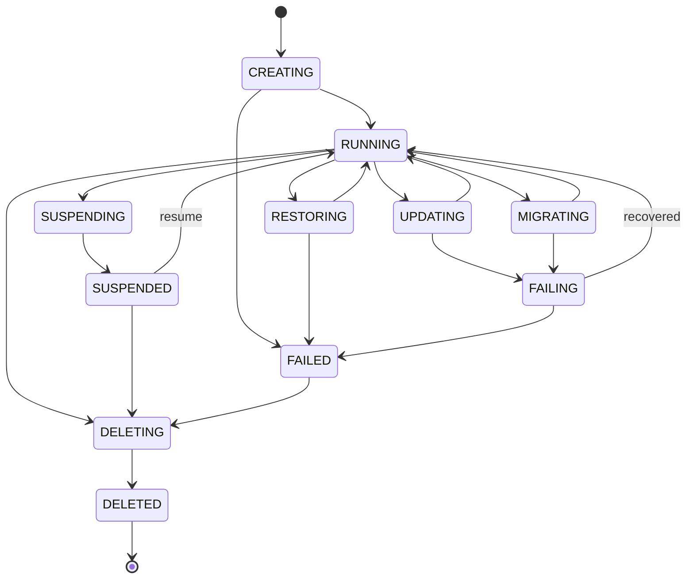

# 02 — Modèle de données du Control Plane

> Ceci est le schéma de la base de **métadonnées** du Control Plane. Elle ne contient
> jamais les données métier des clients — seulement ce qu'il faut savoir pour les
> localiser et les administrer.

## 2.1 Entity-Relationship Diagram (vue Phase 1-4)

```mermaid
erDiagram
    ORGANIZATIONS ||--o{ MEMBERSHIPS : has
    USERS ||--o{ MEMBERSHIPS : has
    ORGANIZATIONS ||--o{ PROJECTS : owns
    ORGANIZATIONS ||--o{ API_KEYS : owns
    ORGANIZATIONS ||--|| SUBSCRIPTIONS : has
    SUBSCRIPTIONS }o--|| PLANS : references
    PROJECTS ||--o{ DATABASES : contains
    REGIONS ||--o{ NODES : contains
    NODES ||--o{ CLUSTERS : hosts
    CLUSTERS ||--o{ DATABASES : hosts
    CLUSTERS ||--o{ CLUSTER_MEMBERS : "primary/replica"
    NODES ||--o{ CLUSTER_MEMBERS : runs
    DATABASES ||--o{ DATABASE_CREDENTIALS : has
    DATABASES ||--o{ BACKUPS : has
    DATABASES ||--o{ RESTORE_JOBS : "restored from"
    DATABASES ||--o{ USAGE_RECORDS : generates
    DATABASES ||--o{ DATABASE_EVENTS : has
    USERS ||--o{ AUDIT_LOGS : performs
    ORGANIZATIONS ||--o{ AUDIT_LOGS : scoped_to
    JOBS ||--o{ DATABASE_EVENTS : produces

    ORGANIZATIONS {
        uuid id PK
        string name
        string slug
        timestamptz created_at
        jsonb settings
    }
    USERS {
        uuid id PK
        string email
        string password_hash
        bool mfa_enabled
        timestamptz created_at
    }
    MEMBERSHIPS {
        uuid id PK
        uuid user_id FK
        uuid organization_id FK
        string role "owner|admin|developer|billing|readonly"
        timestamptz created_at
    }
    PROJECTS {
        uuid id PK
        uuid organization_id FK
        string name
        string slug
        timestamptz created_at
    }
    REGIONS {
        uuid id PK
        string code "eu-west, africa-west..."
        string name
        bool active
    }
    NODES {
        uuid id PK
        uuid region_id FK
        string hostname
        string ip_address
        int cpu_total
        int ram_total_mb
        int storage_total_gb
        string agent_version
        string status "active|maintenance|draining|offline"
        timestamptz last_heartbeat_at
    }
    CLUSTERS {
        uuid id PK
        uuid region_id FK
        string topology "single|primary_replica"
        string postgres_version
        string status
        timestamptz created_at
    }
    CLUSTER_MEMBERS {
        uuid id PK
        uuid cluster_id FK
        uuid node_id FK
        string role "primary|replica"
        int replication_lag_bytes
        timestamptz promoted_at
    }
    DATABASES {
        uuid id PK
        uuid project_id FK
        uuid cluster_id FK
        string name
        string isolation_level "shared|dedicated"
        string status "creating|running|updating|suspending|suspended|restoring|migrating|failing|failed|deleting|deleted"
        int cpu_limit
        int ram_limit_mb
        int storage_limit_gb
        string connection_endpoint
        string connection_endpoint_pooled
        jsonb backup_policy
        timestamptz created_at
        timestamptz deleted_at
    }
    DATABASE_CREDENTIALS {
        uuid id PK
        uuid database_id FK
        string role_name
        string secret_ref "pointeur vers secret manager, jamais le secret en clair"
        string scope "app|readonly|admin"
        timestamptz rotated_at
        timestamptz created_at
    }
    BACKUPS {
        uuid id PK
        uuid database_id FK
        string type "automatic|manual|snapshot"
        string storage_ref
        bigint size_bytes
        string status "pending|completed|failed|verified"
        timestamptz started_at
        timestamptz completed_at
        timestamptz verified_at
    }
    RESTORE_JOBS {
        uuid id PK
        uuid source_backup_id FK
        uuid target_database_id FK
        string restore_type "full|pitr"
        timestamptz target_time
        string status
        timestamptz created_at
    }
    PLANS {
        uuid id PK
        string name "free|developer|pro|business|enterprise"
        jsonb quotas
        jsonb pricing
    }
    SUBSCRIPTIONS {
        uuid id PK
        uuid organization_id FK
        uuid plan_id FK
        string status "active|past_due|canceled"
        timestamptz current_period_start
        timestamptz current_period_end
    }
    USAGE_RECORDS {
        uuid id PK
        uuid database_id FK
        string metric "cpu_hours|storage_gb_hours|egress_gb|connections"
        numeric value
        timestamptz period_start
        timestamptz period_end
    }
    API_KEYS {
        uuid id PK
        uuid organization_id FK
        string name
        string key_prefix
        string key_hash
        jsonb scopes
        timestamptz last_used_at
        timestamptz revoked_at
    }
    AUDIT_LOGS {
        uuid id PK
        uuid organization_id FK
        uuid user_id FK
        string action
        string resource_type
        uuid resource_id
        jsonb before
        jsonb after
        string ip_address
        string result "success|failure"
        timestamptz created_at
    }
    JOBS {
        uuid id PK
        string type "create_database|delete_database|resize|backup|restore|failover"
        string status "queued|running|succeeded|failed|retrying"
        string idempotency_key
        jsonb payload
        jsonb result
        int attempts
        timestamptz created_at
        timestamptz completed_at
    }
    DATABASE_EVENTS {
        uuid id PK
        uuid database_id FK
        uuid job_id FK
        string event_type
        jsonb data
        timestamptz created_at
    }
```

## 2.2 Notes de conception

- **Séparation infra/données** : `NODES` et `CLUSTERS` modélisent l'infrastructure
  PostgreSQL ; `DATABASES` modélise une base cliente au sein d'un cluster (cf. cahier
  des charges §6). Plusieurs `DATABASES` peuvent partager un `CLUSTER` (isolation
  "shared") ou un client premium peut avoir un `CLUSTER` dédié à une seule `DATABASE`
  (isolation "dedicated").
- **Aucun secret en clair** : `DATABASE_CREDENTIALS.secret_ref` pointe vers un secret
  manager (Vault, ou a minima un champ chiffré avec KMS applicatif) — jamais un mot de
  passe en clair dans cette table (cf. §32, §76 règle 15).
- **Traçabilité du placement** : chaque `DATABASE` connaît son `cluster_id`, chaque
  `CLUSTER_MEMBER` connaît son `node_id`, chaque `NODE` connaît sa `region_id`. C'est la
  chaîne complète exigée par la Règle 6 (« quelle base, quel projet, quel tenant, quel
  cluster, quel node, quelle région, quelles ressources, quel statut »). Le tenant est
  retrouvé via `DATABASES.project_id → PROJECTS.organization_id`.
- **Jobs comme source de vérité des opérations longues** : `JOBS` porte
  `idempotency_key` pour éviter les doubles exécutions (Règle 12) et `attempts`/`status`
  pour les retries. `DATABASE_EVENTS` est le flux d'événements associé, utile pour
  reconstituer l'historique d'une base sans dépendre uniquement de son `status` courant.
- **Usage/billing découplé** : `USAGE_RECORDS` est alimenté par le monitoring, pas par
  une logique ad hoc dans l'API — évite les incohérences de facturation.
- **Ce schéma est celui de la Phase 1-4.** Il a été étendu en Phase 6+ (réplication déjà
  esquissée via `CLUSTER_MEMBERS`), Phase 9 (schéma microfinance séparé, cf.
  [08](08-microfinance-et-billing.md)), et Phase 10 (facturation détaillée : invoices,
  line items — cf. [08 §8.16](08-microfinance-et-billing.md#816-phase-10--billing-et-saas--implémentée-2026-09-19)
  pour le détail complet de l'implémentation).

## 2.3 Machine à états d'une base (`DATABASES.status`)

Le Control Plane distingue toujours **état déclaré** (ce que l'API a demandé) et
**état observé** (ce que le Data Plane Agent rapporte réellement). Un job n'est marqué
`succeeded` qu'après confirmation de l'état observé par l'agent — jamais de manière
optimiste côté API.
