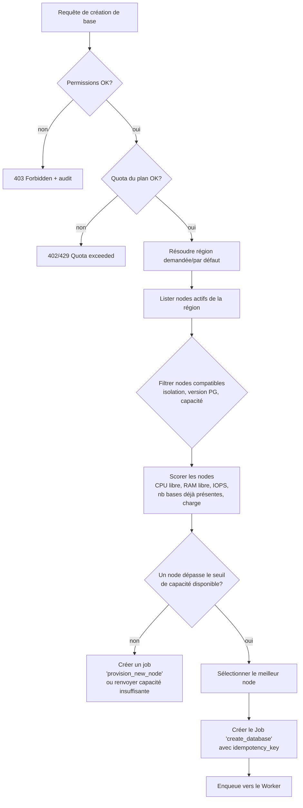
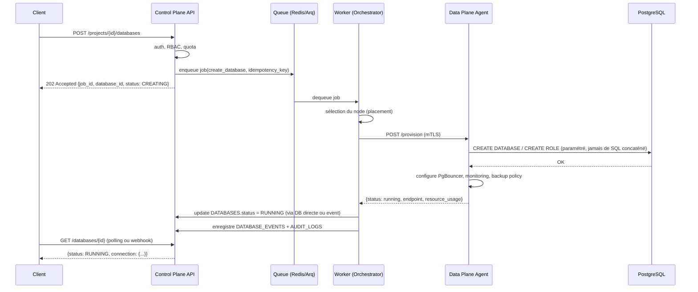
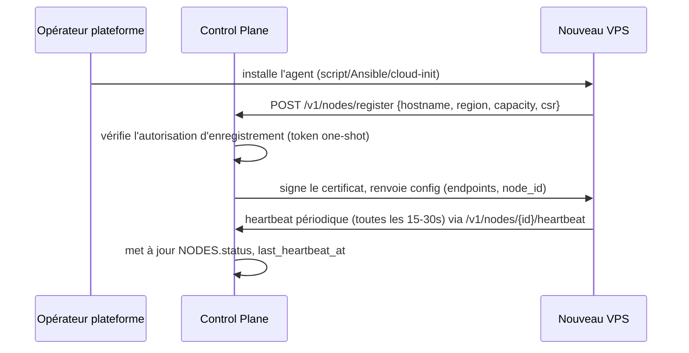

# 03 — Database Orchestrator & Data Plane Agent

## 3.1 Database Orchestrator

Service du Control Plane, séparé logiquement de l'API HTTP synchrone (il consomme une
queue de jobs). Responsable du cycle de vie complet d'une base.

### Responsabilités

| Domaine | Fonctions |
|---|---|
| Provisioning | placement (choix node/cluster/région), création, credentials, permissions, pooling, backup, monitoring |
| Lifecycle | start, stop, restart, suspend, resume, delete, recreate, migrate |
| Resources | allocation CPU/RAM/storage, limites de connexions, replicas |
| Reliability | health checks, détection de panne, failover, réplication |
| Maintenance | upgrades PostgreSQL, extensions, configuration |

### Algorithme de placement



Le scoring (§7 du cahier des charges) est un calcul simple et explicite au démarrage
(ex : `score = w1*cpu_libre + w2*ram_libre + w3*(1 - nb_bases/max_bases) - w4*charge`),
pas un mécanisme "boîte noire". Les poids sont configurables, pas codés en dur.

### Jobs et idempotence

Chaque opération longue est un enregistrement dans `JOBS` (cf. [02](02-modele-donnees.md))
avec :
- un `idempotency_key` dérivé de la requête cliente (évite la double création si le
  client retente une requête réseau en timeout) ;
- un nombre de tentatives borné avec backoff exponentiel ;
- un état terminal explicite (`succeeded`/`failed`), jamais de silence.



Le client interagit uniquement en HTTP asynchrone (202 + polling, ou webhook) —
jamais de requête HTTP bloquante de 30 secondes pendant qu'un `CREATE DATABASE` tourne
quelque part (Règle 11).

## 3.2 Data Plane Agent

Processus tournant sur chaque node, seul autorisé à exécuter des opérations locales.

### Surface exposée au Control Plane

```
POST   /v1/provision/database      -- créer une base + rôle + credentials
DELETE /v1/database/{name}         -- supprimer une base
POST   /v1/database/{name}/suspend
POST   /v1/database/{name}/resume
POST   /v1/database/{name}/resize  -- ajuster limites de connexions/ressources cgroups
GET    /v1/resources                -- CPU/RAM/disque disponibles
GET    /v1/health                   -- statut PostgreSQL, Redis, PgBouncer
POST   /v1/backup/run
POST   /v1/backup/verify
POST   /v1/restore
GET    /v1/metrics                  -- exposé aussi en scrape Prometheus direct
```

### Sécurité de la communication Control Plane ↔ Agent

- mTLS obligatoire (certificats émis par une CA interne à la plateforme, provisionnés
  au moment de l'enregistrement du node).
- Chaque agent a une identité unique (`node_id`) liée à son certificat — pas de secret
  partagé unique pour tous les nodes.
- L'agent n'accepte des commandes que depuis le Control Plane (allowlist réseau +
  vérification du certificat client), jamais depuis Internet public.
- Toute commande reçue est journalisée localement et remontée en audit log côté
  Control Plane.

### Construction sécurisée des commandes SQL

Rappel du cahier des charges (§10, étape 11) : **jamais de SQL construit par
concaténation de chaîne à partir d'une entrée utilisateur**. L'agent :
- valide le nom de la base/du rôle contre une regex stricte (`^[a-z][a-z0-9_]{2,62}$`)
  avant toute opération, côté API **et** côté agent (défense en profondeur) ;
- utilise des identifiants PostgreSQL passés via `psycopg`/`asyncpg` avec
  `sql.Identifier` (jamais de f-string dans une requête DDL) ;
- génère les mots de passe côté agent avec un générateur cryptographiquement sûr
  (`secrets.token_urlsafe`), jamais fournis par le client.

### Enregistrement d'un node (bootstrap)



Un node sans heartbeat récent passe automatiquement `offline` côté Control Plane et
est exclu du placement — sans intervention manuelle.

## 3.3 Ce que l'Orchestrator ne fait jamais

- Il ne se connecte jamais directement à PostgreSQL sur un node (toujours via l'agent).
- Il ne suppose jamais qu'un node particulier est "le" node par défaut.
- Il ne marque jamais une opération comme terminée sans confirmation de l'agent.
- Il ne supprime jamais une ressource sans un job explicite et audité (pas de suppression
  en cascade implicite).
