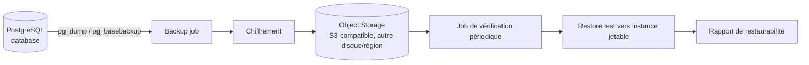
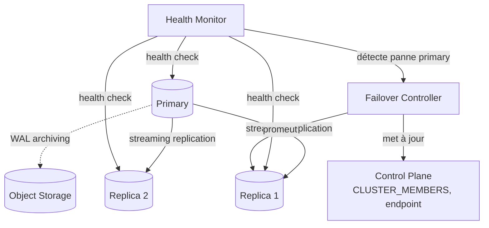
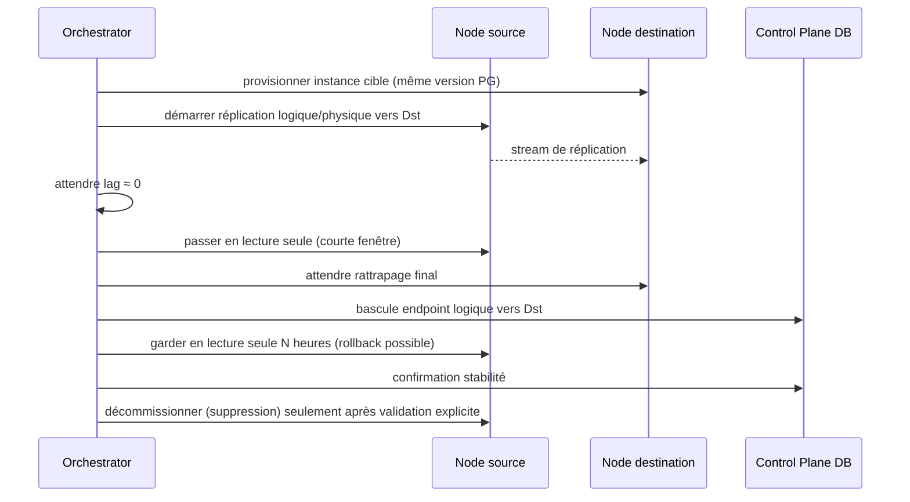

# 05 — Backup, PITR, Haute disponibilité, Scaling, Disaster Recovery

## 5.1 Backups



- Backups **automatiques** (politique par plan : fréquence, rétention) et **manuels**
  (à la demande).
- Jamais stockés uniquement sur le disque du node primaire — toujours répliqués vers
  l'object storage, idéalement dans une autre zone/région physique.
- Chiffrés au repos (SSE côté object storage ou chiffrement applicatif avant upload).
- Chaque backup a un statut `pending → completed → verified` — un backup `completed`
  mais jamais `verified` doit déclencher une alerte après un délai configurable
  (cahier des charges §59 : *"un backup ne doit jamais être considéré comme fiable
  simplement parce qu'il a été créé"*).

## 5.2 Point-In-Time Recovery

```
Base backup (pg_basebackup) + archivage continu des WAL
        │
        ▼
Restauration à un instant T = dernier base backup ≤ T + replay WAL jusqu'à T
```

Prérequis techniques :
- `archive_mode = on` avec `archive_command` poussant chaque WAL vers l'object storage
  au fur et à mesure (pas seulement au moment du backup).
- Rétention WAL alignée sur la politique PITR du plan (ex : 7 jours Pro, 30 jours
  Enterprise).
- La restauration PITR crée une **nouvelle** `DATABASE`/instance (jamais un écrasement
  in-place de la base source) ; validation puis bascule explicite si le client veut
  remplacer la base originale.

## 5.3 Réplication et Haute Disponibilité



- `CLUSTER_MEMBERS` (cf. [02](02-modele-donnees.md)) modélise déjà primary/replica et
  le lag de réplication.
- Le **Health Monitor** (composant du Data Plane Agent + un service de supervision
  côté Control Plane) détecte une panne via heartbeats manqués + vérification directe.
- Le **failover** est un job orchestré (pas manuel) : promotion du replica le plus à
  jour, mise à jour de l'endpoint (le client se reconnecte au même nom DNS/endpoint
  logique — jamais besoin de changer sa chaîne de connexion), reconstruction d'un
  nouveau replica pour retrouver la redondance.
- Tant qu'un seul node existe (Phase 2-3), la HA n'est pas activable — c'est acceptable
  et documenté : la HA est un livrable de Phase 6, pas une exigence du MVP.

## 5.4 Scaling

| Type | Mécanisme |
|---|---|
| Vertical | Resize CPU/RAM/storage du node ou du conteneur PostgreSQL (limites cgroups), opération `resize` via Orchestrator, avec fenêtre de maintenance si redémarrage requis |
| Horizontal (lecture) | Ajout de replicas pour répartir la charge de lecture |
| Horizontal (écriture/capacité) | Ajout de nodes/clusters, migration de bases pour rééquilibrer (cf. 5.6) |
| Connexions | PgBouncer en mode transaction pooling, limites par projet configurables |

Le scaling est toujours une opération déclarée (`UPDATING` dans la machine à états),
jamais un changement silencieux de ressources.

## 5.5 Disaster Recovery — scénarios et réponses

| Scénario | Réponse |
|---|---|
| Un VPS tombe | Health Monitor détecte l'absence de heartbeat → node passé `offline` → si le node hébergeait un primary avec replicas, failover automatique → sinon, alerte + restauration depuis le dernier backup sur un nouveau node |
| PostgreSQL corrompu | Isolation de l'instance, restauration depuis le dernier backup vérifié + replay WAL (PITR) vers un nouveau node |
| Disque perdu | Les données ne vivent jamais uniquement sur ce disque — backups + WAL sont sur l'object storage, séparé physiquement ; reconstruction complète possible |
| Backup corrompu | D'où l'importance de 5.1 (vérification périodique) — on bascule sur le backup vérifié précédent, avec perte de données bornée et documentée au client |
| Control Plane tombe | Le Data Plane continue de servir les connexions existantes (les bases ne dépendent pas du Control Plane pour fonctionner) ; seules les opérations d'administration sont indisponibles ; Control Plane doit être déployé avec sa propre redondance (au minimum backups de sa base de métadonnées) |
| Région indisponible | Bascule possible uniquement pour les clients ayant opté pour une réplication cross-région (fonctionnalité Phase 7+) ; pour les autres, restauration dans une région alternative depuis les backups (RPO = dernier backup/WAL archivé) |

Chaque scénario doit avoir, à la fin de la Phase 5-6, une procédure **documentée et
testée** (pas seulement écrite) — cf. critères de sortie dans
[09-plan-de-phases.md](09-plan-de-phases.md).

## 5.6 Migration d'une base entre nodes



Aucune étape destructive (décommissionnement de la source) n'est exécutée avant
confirmation explicite que la cible fonctionne correctement (Règle du cahier des
charges §18).

## 5.7 Rapport de test des scénarios de Disaster Recovery (Phase 11, 2026-09-19)

Critère de sortie de la Phase 11 : chaque scénario du tableau §5.5 testé **en
conditions réelles** au moins une fois, avec rapport. Environnement : backend +
worker + scheduler + agent réels, PostgreSQL réel (`eminidb-node-postgres` +
réplique en streaming réelle), MinIO réel — mêmes composants qu'en production,
mêmes binaires, aucune simulation applicative.

### Un VPS tombe

Testé en conditions réelles et documenté en détail en **Phase 6**
([09-plan-de-phases.md](09-plan-de-phases.md), Phase 6) : primary réellement
arrêté, health monitor du scheduler détecte l'absence de heartbeat, failover
automatique déclenché, vraie promotion PostgreSQL (`pg_promote()`), endpoint
client repointé automatiquement, données antérieures intactes, nouvelle écriture
réussie sur le nouveau primary. Aucun code de ce chemin (`ha_orchestrator.py`,
`node_health.py`, le tick `check_and_failover_unhealthy_clusters` du scheduler)
n'a été modifié depuis. Reconfirmé partiellement en Phase 11 : la réplique
(`eminidb-node-postgres-replica`) a été retrouvée **toujours en streaming réel
et sain** avant et après un cycle complet d'arrêt/redémarrage de Docker Desktop
(cf. incident ci-dessous) sans aucune intervention manuelle, et le mécanisme de
détection de staleness (`HEARTBEAT_STALE_SECONDS = 60`,
`app/services/node_health.py`) a été reconfirmé en direct : agent arrêté →
`effective_status` du node passe bien à `offline` via l'API réelle une fois le
délai dépassé. Le cycle complet destructif (attachement d'une nouvelle réplique
+ failover + reconstruction de la topologie) n'a pas été rejoué intégralement en
Phase 11 — jugé redondant avec la preuve déjà complète et récente de la Phase 6,
par souci de temps.

### PostgreSQL corrompu

Testé en conditions réelles : backup vérifié restauré vers une nouvelle base,
données confirmées intactes et accessibles en écriture sous l'identité du
tenant (pas seulement l'admin). **Limite assumée et déjà documentée depuis les
Phases 5-6** : la restauration est **logique** (`pg_dump`/`pg_restore`), pas un
vrai PITR par rejeu de WAL continu — le RPO est donc "au dernier backup", pas
"à l'instant exact précédant la corruption". Le PITR reste différé (cf. §5.2 et
Phase 6), techniquement prêt à être construit sur l'infrastructure de
réplication déjà en place, mais non implémenté.

### Disque perdu

Satisfait par construction, démontré par le test de restauration ci-dessus : le
backup restauré provient exclusivement de MinIO (object storage), jamais du
disque de la base source — la preuve en a été faite involontairement de la
façon la plus convaincante possible (cf. l'incident ci-dessous : le conteneur
MinIO a réellement perdu son volume suite à un crash de Docker Desktop pendant
cette session de tests, sans affecter les conteneurs PostgreSQL). **Limite de ce
bac à sable non présente dans une architecture cible réelle** : MinIO tourne ici
en **mono-nœud, sans erasure coding ni réplication** — un vrai déploiement de
production doit utiliser soit un vrai service S3 managé, soit un cluster MinIO
à plusieurs nœuds/disques, précisément pour éviter la classe d'incident observée
ici. Recommandation de durcissement notée, pas seulement un constat.

### Backup corrompu

Testé en conditions réelles, deux fois : contre des backups **réellement**
`verification_failed` (voir incident ci-dessous) puis contre un backup fraîchement
créé et vérifié. `POST .../backups/{id}/restore` sur un backup non restaurable
renvoie bien `409` (`"Backup is not restorable (status=verification_failed)"`) ;
la restauration depuis le backup verified suivant réussit et rend des données
intactes. Le garde-fou qui empêche une re-vérification automatique d'un backup
déjà marqué `verification_failed` (`execute_verify_backup` renvoie
`{"skipped": true, ...}`) a été découvert à cette occasion — comportement
voulu (ne pas re-tester en boucle quelque chose de déjà confirmé mauvais), pas
un bug, mais qui a nécessité de créer un nouveau backup pour prouver le
correctif ci-dessous plutôt que de re-vérifier l'ancien.

### Control Plane tombe

Testé en conditions réelles : backend + worker + scheduler entièrement arrêtés,
une vraie écriture (`INSERT`) exécutée avec succès en connexion directe à
PostgreSQL en utilisant les identifiants précédemment obtenus via l'API —
confirmant que le Data Plane ne dépend en rien du Control Plane pour continuer à
servir un client déjà connecté/informé de ses identifiants. Control Plane
redémarré ensuite sans incident, base toujours suivie correctement.

### Région indisponible

**Non implémenté, confirmé et non testé** — la réplication cross-région n'existe
pas ; la migration cross-région est explicitement rejetée par le code
(`database_admin.py`, cf. Phase 7 : "changerait silencieusement la résidence des
données"). Limitation documentée depuis la Phase 7, pas un oubli de la Phase 11.

### Incident réel survenu pendant cette campagne de tests (non simulé)

Pendant les tests de cette phase, **Docker Desktop s'est arrêté puis a dû être
redémarré manuellement** (incident d'environnement, pas provoqué délibérément).
Conséquences observées :
- Les conteneurs PostgreSQL (primary, réplique, node C) ont **survécu sans
  perte de données ni de réplication** — la réplique s'est reconnectée au
  primary automatiquement dès le redémarrage, sans aucune intervention.
- Le conteneur MinIO, lui, a **réellement perdu tout son volume** (bucket et
  objets disparus) — cause probable : corruption de métadonnées internes
  (`.minio.sys`) d'une instance MinIO mono-disque après un arrêt non propre,
  une faiblesse opérationnelle connue de ce mode de déploiement. Recréé
  proprement avec un volume Docker **nommé** (`eminidb-minio-data`, au lieu
  d'un volume anonyme) — amélioration de traçabilité, qui ne résout pas à elle
  seule le vrai problème de durabilité (toujours mono-nœud).
- Cet incident a permis de retrouver et fixer un **vrai bug** : le fichier
  `agent/.env` de test manuel de cette session portait
  `PG_DUMP_COMMAND_PREFIX=docker,exec,eminidb-node-postgres`, **sans le flag
  `-i`** — `docker exec` sans `-i` ne relaie jamais le stdin du process hôte
  vers le conteneur, donc tout `pg_restore` (qui lit son dump depuis stdin)
  recevait un flux vide immédiatement (`pg_restore: error: input file is too
  short (read 0, expected 5)`), alors que `pg_dump` (qui écrit sur stdout,
  jamais sur stdin) fonctionnait normalement et rapportait une taille de
  fichier réelle et correcte — masquant le problème jusqu'à ce qu'une vraie
  restauration soit tentée. `agent/.env.example` avait déjà la bonne valeur
  documentée avec `-i` ; c'est une erreur de transcription faite plus tôt
  dans cette session de travail (pas un bug préexistant du projet), et les
  tests automatisés de l'agent (`agent/tests/conftest.py`) ont leur propre
  défaut correct, donc n'ont jamais été affectés. Corrigé dans `agent/.env` et
  le commentaire de `agent/app/config.py` clarifié pour que l'erreur soit plus
  difficile à reproduire à l'avenir.

### Bug produit réel trouvé et corrigé pendant cette phase (hors DR, RBAC/quotas)

Sans rapport direct avec le tableau DR mais trouvé par un test de concurrence
écrit pour cette même phase : `POST .../databases` avait une race condition
TOCTOU — deux requêtes de création simultanées pouvaient toutes les deux passer
la vérification de quota avant qu'aucune ne valide son insertion, permettant à
un plan `free` (1 base max) de se retrouver avec 2 bases. Corrigé avec un
verrou `asyncio.Lock` par organization (`app/services/quotas.py::
get_organization_lock`), qui sérialise "vérifier le quota, puis créer" pour une
même organization — limitation assumée et documentée : ce verrou est
process-local, cohérent avec le déploiement mono-instance actuel de la
plateforme (comme la file de jobs ou le rate limiter), et nécessiterait un vrai
verrou distribué (verrou consultatif PostgreSQL) pour un Control Plane à
plusieurs instances.
