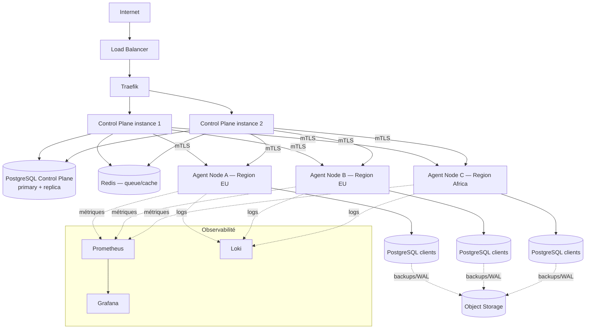

# 06 — Réseau et déploiement

## 6.1 Topologie de développement (Phase 1-3)

```mermaid
flowchart TB
    subgraph Machine locale / VPS unique
        NX[Next.js dev] --> FA[FastAPI Control Plane]
        FA --> RDS[Redis local]
        FA -.métadonnées.-> NEON[(Neon Postgres — dev only)]
    end
    subgraph VPS de test — Data Plane
        AGENT[Data Plane Agent] --> PGD[(PostgreSQL)]
        AGENT --> RDD[(Redis)]
        AGENT --> PBD[PgBouncer]
    end
    FA -->|mTLS| AGENT
```

## 6.2 Topologie de production cible (Phase 6-7)



## 6.3 Conteneurisation

- **Phase 0-6** : Docker Compose par environnement (`docker-compose.controlplane.yml`,
  `docker-compose.dataplane.yml`). Suffisant tant que le nombre de nodes reste gérable
  par un provisioning scripté (Ansible/cloud-init) et que l'orchestration inter-nodes
  reste au niveau applicatif (l'Orchestrator, pas Kubernetes).
- **Phase 7+** : évaluation de Kubernetes uniquement si le nombre de nodes/clusters
  justifie un orchestrateur de conteneurs générique (auto-scaling, self-healing au
  niveau infra). Ce n'est pas une certitude à ce stade — décision à documenter avec
  une vraie analyse coût/bénéfice le moment venu, pas un choix par défaut.

## 6.4 Régions et nodes

- `REGIONS` est une table, pas une constante applicative — ajouter une région = une
  insertion + une configuration réseau, pas une modification de code.
- Un `NODE` déclare sa capacité (`cpu_total`, `ram_total_mb`, `storage_total_gb`) à
  l'enregistrement ; l'Orchestrator ne fait jamais d'hypothèse fixe sur la capacité
  d'un node.
- Le provisioning d'un nouveau node est scripté (cloud-init + installation de l'agent +
  enregistrement automatique via token one-shot, cf. [03](03-database-orchestrator-et-agent.md#enregistrement-dun-node-bootstrap)) —
  objectif : ajouter un node ne doit jamais être une opération manuelle non reproductible.

## 6.5 CI/CD et stratégie de déploiement

- Déploiement du Control Plane : pipeline CI (build, tests, migration de schéma via
  outil de migration versionné type Alembic) → déploiement rolling (au moins 2
  instances derrière le LB dès que la charge le justifie).
- Déploiement du Data Plane Agent : versionné indépendamment du Control Plane (compatibilité
  ascendante de l'API entre agent et control plane à maintenir) ; mise à jour progressive
  node par node, jamais un déploiement simultané sur tous les nodes.
- Migrations de schéma de métadonnées : toujours rétrocompatibles avant déploiement du
  code qui les utilise (expand/contract pattern) — pas de migration destructive
  synchronisée avec un déploiement de code.
- Aucune modification de configuration réseau/pipeline CI ne doit être poussée sans
  revue explicite (cf. règles générales de sécurité des actions).
