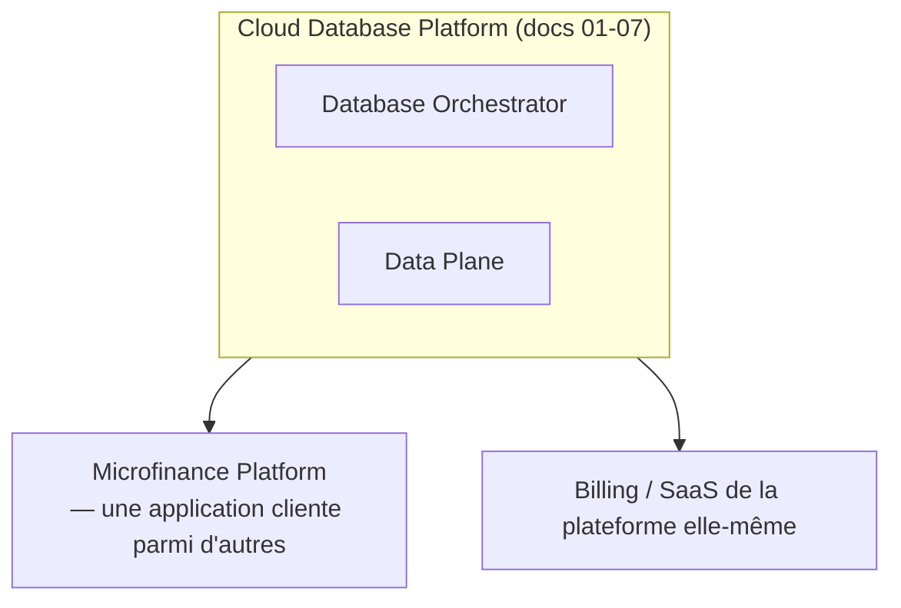
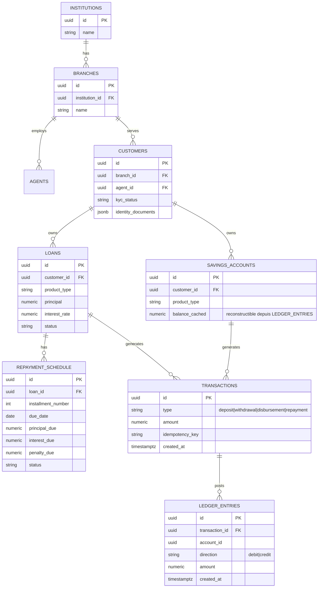
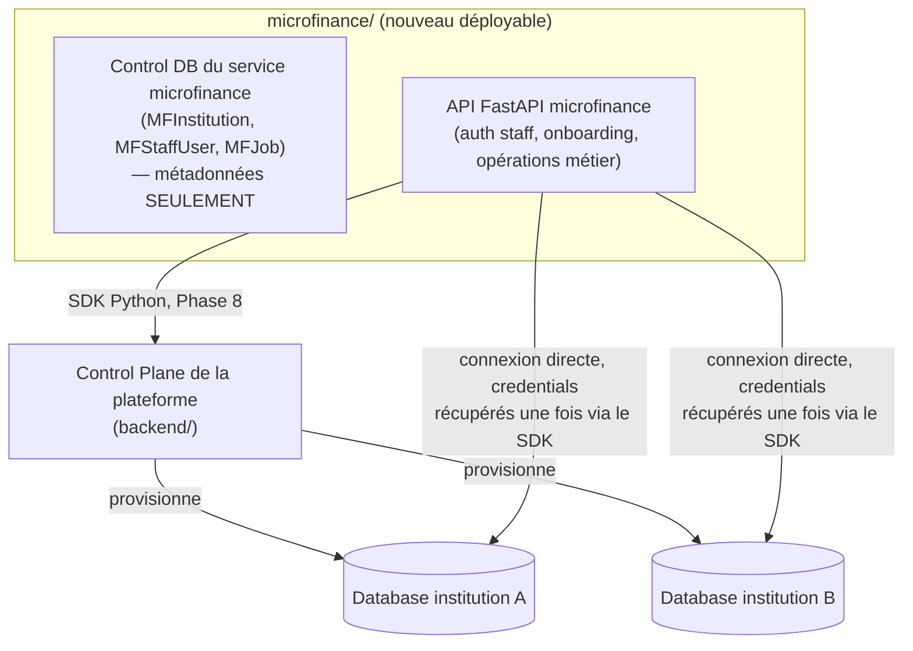

# 08 — Module Microfinance & Billing plateforme

> Ces deux modules sont des **applications métier construites au-dessus** de
> l'infrastructure Cloud Database. Ils utilisent les primitives des documents 01-07
> (projets, bases provisionnées, credentials, backups) — ils ne les redéfinissent pas.

## 8.1 Positionnement architectural

Une institution de microfinance est, du point de vue du Control Plane, **une
organization avec un ou plusieurs projects et databases comme n'importe quel autre
client**. Le module microfinance est un ensemble d'API/schémas métier qui tournent sur
une base provisionnée par l'infrastructure standard — pas un système parallèle.

## 8.2 Modèle de données microfinance (aperçu — détaillé en Phase 9)

Principe non négociable (cahier des charges §41/§45) : **le solde n'est jamais un champ
modifié directement**. `balance_cached` est une dénormalisation reconstructible à tout
moment à partir de `LEDGER_ENTRIES` — toute transaction financière s'écrit d'abord dans
le ledger (double écriture débit/crédit), le solde caché n'est qu'une optimisation de
lecture, jamais la source de vérité.

Toute opération financière (`TRANSACTIONS`) porte un `idempotency_key` pour éviter les
doubles traitements (paiement mobile money rejoué, retry réseau, etc.).

## 8.3 Décision d'architecture (validée avec le porteur de projet, 2026-09-19)

Trois options ont été mises en balance avant de démarrer la Phase 9 :

1. Service séparé, multi-institutions, **dogfooding réel du SDK** de la Phase 8 — ✅
   retenue.
2. Service séparé, une institution par déploiement — rejetée : n'exploite pas le
   multi-tenant de la plateforme, contredit le schéma déjà esquissé en 8.2
   (`INSTITUTIONS` au pluriel), et un nouveau client nécessiterait un déploiement
   complet.
3. Module intégré à `backend/` (Control Plane) — rejetée : mélangerait des données
   métier client dans la base de métadonnées du Control Plane, qui ne doit contenir
   que des métadonnées d'infrastructure (Règle 19), et casserait l'isolation
   multi-tenant construite depuis la Phase 3.

**Conséquence directe** : `microfinance/` est un **nouveau déployable top-level**,
au même titre que `backend/` et `agent/` — mais contrairement à eux, ce n'est **pas**
un composant de la plateforme elle-même : c'est **un client** de la plateforme, exactement
comme le serait n'importe quel développeur tiers utilisant le SDK Python de la Phase 8.

**Granularité retenue : un `project` (+ sa `database`) par institution, au sein d'une
seule `organization` CP** — celle du produit microfinance lui-même (créée une fois, au
bootstrap du service, pas par institution). Le personnel des institutions n'a jamais de
compte Control Plane et n'a donc aucune raison d'avoir sa propre `organization` ; c'est
le **service microfinance** qui est le tenant de la plateforme (comme n'importe quel
développeur tiers), et chaque institution qu'il sert est un `project` de ce tenant.
Une seule paire d'identifiants CP (un `User` + son `access_token`, obtenus une fois via
`register`/`login` du SDK et conservés côté service) suffit pour onboarder toutes les
institutions — pas un compte CP par institution. C'est la preuve par l'usage que la
plateforme des Phases 1-8 fonctionne pour un vrai cas d'usage métier multi-tenant, pas
seulement pour les tests de la CLI.

## 8.4 Architecture en deux niveaux (fractale : le service microfinance a lui-même
un Control Plane et un Data Plane)

Le même principe de séparation qui gouverne toute la plateforme (doc
[01](01-architecture-globale.md)) se reproduit **à l'intérieur** du service
microfinance, à une échelle plus petite :

- **Control DB du service microfinance** (`microfinance/mf_app/db/control_*.py`,
  `microfinance/mf_app/models/{platform_account,institution,staff_user,job}.py`) : une petite
  base de métadonnées propre au service (comme la base de métadonnées du Control Plane,
  mais un niveau au-dessus) — contient `MFPlatformAccount` (les identifiants CP du
  service microfinance lui-même — un seul enregistrement, `organization_id` + token/API
  key), `MFInstitution` (mapping institution ↔ `project_id`/`database_id` de la
  plateforme + connexion chiffrée) et `MFStaffUser` (comptes du personnel de
  l'institution — agents, gérants d'agence — **distincts des `USERS` du Control
  Plane**, qui eux gèrent
  l'infrastructure cloud, pas les opérations de microfinance). Jamais de donnée métier
  (client, compte, prêt, transaction) ici.
- **Bases "Data Plane" du point de vue microfinance** = les `databases` provisionnées
  par la plateforme, une par institution. C'est là que vit tout le schéma métier détaillé
  en 8.2/8.6 (branches, agents, clients, comptes, prêts, ledger). Isolation totale entre
  institutions : chacune a sa propre base PostgreSQL, ses propres credentials, exactement
  le même modèle que n'importe quel autre tenant de la plateforme.
- **Bootstrap du service** (une fois, `microfinance/scripts/bootstrap_platform_account.py`,
  même esprit que `backend/scripts/promote_platform_admin.py`) : `register`/`login` SDK
  d'un unique compte CP pour le produit microfinance, `create_organization` une seule
  fois, identifiants stockés dans `MFPlatformAccount` (Control DB). Tout le reste de la
  vie du service réutilise ce même compte/cette même organization.
- **Onboarding d'une institution** (`microfinance/mf_app/services/onboarding.py`) : à
  partir du `MFPlatformAccount` déjà bootstrapé → `create_project` (un project par
  institution, au sein de l'organization unique) → `create_database` → `wait_for_job`
  jusqu'à `RUNNING` → `get_connection` → credentials chiffrés (Fernet, même schéma que
  partout ailleurs) stockés dans `MFInstitution` → exécution des migrations Alembic
  **tenant** (8.5) contre cette base précise. Réservé à un rôle interne `is_mf_operator`
  (opérateur du produit microfinance, pas un administrateur de plateforme, pas un membre
  du personnel d'une institution) — pas de self-service à ce stade, documenté comme
  limitation assumée (cf. 8.11).

## 8.5 Deux jeux de migrations Alembic (fan-out par tenant)

Contrairement à `backend/` qui n'a qu'une seule base à migrer, le service microfinance
en a **N+1** :

- `microfinance/alembic_control/` — migre la Control DB du service (une seule base,
  comme d'habitude).
- `microfinance/alembic_tenant/` — migre le **schéma métier**, et doit être rejoué contre
  **chaque** base d'institution existante à chaque déploiement. Une commande dédiée
  (`python -m app.migrate_tenants`) itère sur tous les `MFInstitution` actifs et applique
  `alembic_tenant upgrade head` à la connexion de chacun — modélisé comme un job dans la
  propre file `MFJob` du service (même pattern "la table jobs est la queue" que
  `backend/app/services/jobs.py` depuis la Phase 3), puisque migrer N bases peut être
  long et doit être retryable/traçable, pas un script qu'on relance à la main en
  espérant qu'il ne plante pas au milieu.

## 8.6 Modèle de données détaillé (schéma tenant — vit dans la base de chaque institution)

Complète le schéma d'aperçu de 8.2 :

- `INSTITUTIONS` — une seule ligne par base (configuration : nom, devise, année
  fiscale, plan de comptes par défaut). Le fait qu'il n'y ait qu'une ligne est
  intentionnel : l'isolation se fait par base, pas par `institution_id` en colonne.
- `BRANCHES`, `AGENTS` (le personnel opérationnel — distinct de `MFStaffUser` qui est
  le compte de connexion ; un `AGENT` a un `MFStaffUser` associé côté Control DB via un
  identifiant opaque, jamais de FK cross-base directe puisque ce sont deux bases
  PostgreSQL séparées).
- `CUSTOMERS` (KYC : `kyc_status` pending/verified/rejected, `identity_documents` jsonb).
- `SAVINGS_PRODUCTS` / `SAVINGS_ACCOUNTS` (`balance_cached`, reconstructible).
- `LOAN_PRODUCTS` (méthode d'amortissement : `declining_balance` ou `flat`, taux, durée
  min/max) / `LOANS` (`status` : draft→pending_approval→approved→disbursed→
  active→closed/defaulted/rejected — machine à états explicite, pas de statut libre).
- `REPAYMENT_SCHEDULES` (versionné : `schedule_version`, une restructuration crée une
  **nouvelle** version sans supprimer l'ancienne — traçabilité, cahier des charges §45)
  et `REPAYMENT_SCHEDULE_LINES` (`installment_number`, `due_date`, `principal_due`,
  `interest_due`, `penalty_due`, `status`).
- `TRANSACTIONS` (`type`, `amount`, `idempotency_key` **unique**, `created_at`) /
  `LEDGER_ENTRIES` (`transaction_id`, `account_id`, `direction` debit/credit, `amount`).
- `CHART_OF_ACCOUNTS` (Phase 9.4) — mappe les comptes internes du ledger (comptes clients,
  comptes de caisse, comptes de produits d'intérêt) vers un plan comptable exportable.

Types monétaires : **`NUMERIC(18, 2)` partout, jamais `FLOAT`/`DOUBLE`** — cahier des
charges, calculs financiers déterministes et non-flottants.

## 8.7 Le moteur de ledger — le seul point d'écriture financière

Principe non négociable (déjà posé en 8.2, détaillé ici) : **une seule fonction**
(`app/services/ledger.py::post_transaction`) a le droit d'insérer des `LEDGER_ENTRIES`.
Personne d'autre — ni un endpoint, ni un script d'admin — n'écrit dans cette table
directement.

`post_transaction(db, *, type, idempotency_key, lines: list[LedgerLine])` :
1. Si `idempotency_key` existe déjà (contrainte unique) → retourne la transaction
   existante sans rien ré-écrire (rejeu réseau, retry mobile money, etc. — jamais de
   double comptabilisation).
2. Assertion dure `sum(debits) == sum(credits)` — violée uniquement par un bug, jamais
   par une entrée utilisateur (ce n'est pas une erreur métier récupérable).
3. Insère `Transaction` + toutes les `LedgerEntry` dans **une seule transaction
   PostgreSQL**.
4. Met à jour `balance_cached` sur les comptes affectés — dénormalisation de lecture
   uniquement. Une fonction `reconcile_balance(account_id)` recalcule le solde en
   rejouant les `LedgerEntry` et sert de test de non-régression permanent (le cache ne
   doit jamais diverger de la source de vérité).

`savings.py` (dépôt/retrait) et `loans.py` (décaissement/remboursement) n'ont **aucune**
logique de solde propre — ils construisent des `LedgerLine` et appellent
`post_transaction`, point.

## 8.8 Échéancier de remboursement (Phase 9.3)

Deux méthodes d'amortissement supportées dès le départ, formule documentée et testée
(pas de "magie" cachée dans le code) :
- **`declining_balance`** (amortissement constant) :
  `installment = P × r / (1 − (1 + r)⁻ⁿ)` où `r` = taux périodique, `n` = nombre
  d'échéances ; intérêt de chaque échéance = solde restant × `r`, principal = installment
  − intérêt.
- **`flat`** (taux fixe sur le principal d'origine) : intérêt constant à chaque échéance
  = `P × r`, principal constant = `P / n`.

Calculée **une fois** à l'approbation du prêt, stockée en base (`REPAYMENT_SCHEDULE_LINES`)
— jamais recalculée à la volée. Une restructuration crée une nouvelle version de
l'échéancier (8.6) plutôt que de modifier les lignes existantes.

## 8.9 Auth et RBAC du personnel d'institution

Distinct du RBAC du Control Plane (`owner`/`admin`/`developer`/`billing`/`readonly`,
doc [04](04-securite-et-isolation.md)) — ce sont des rôles **métier microfinance**,
scopés à une institution, jamais à un projet cloud :

| Rôle | Peut |
|---|---|
| `institution_admin` | tout au sein de l'institution, gestion du personnel |
| `branch_manager` | gérer une agence, approuver des prêts jusqu'à un plafond |
| `loan_officer` | créer/instruire des dossiers de prêt, pas les approuver |
| `teller` | dépôts/retraits/remboursements en agence, pas de gestion de prêt |

Toutes les routes métier sont scopées par URL :
`/institutions/{institution_slug}/...` (même convention que
`/organizations/{organization_id}/...` côté plateforme) — défense en profondeur : un JWT
émis pour l'institution A est structurellement inutilisable sur les routes de
l'institution B, même en cas de défaillance ailleurs dans la résolution de tenant.
`MFStaffUser` est scopé à une seule institution (pas de compte partagé entre
institutions, contrairement aux `USERS` du Control Plane qui peuvent appartenir à
plusieurs organizations).

## 8.10 Découpage en sous-phases

Le périmètre de la Phase 9 est trop large pour une seule itération testée/vérifiée de
bout en bout (Règle : Implémenté + Testé + Sécurisé + Documenté + Monitoré avant de
passer à la suite). Découpage :

- **9.1 — Fondations** : déployable `microfinance/`, Control DB
  (`MFInstitution`/`MFStaffUser`/`MFJob`), onboarding d'institution (dogfooding SDK réel
  contre le backend de la Phase 8), auth staff + RBAC (8.9), migrations tenant (8.5).
- **9.2 — Ledger et épargne** : moteur de ledger (8.7), `CUSTOMERS`/KYC,
  `SAVINGS_PRODUCTS`/`SAVINGS_ACCOUNTS`, dépôt/retrait, `reconcile_balance`.
- **9.3 — Crédit** : `LOAN_PRODUCTS`/`LOANS`, échéancier (8.8), cycle complet demande →
  approbation → décaissement → remboursement → clôture — c'est le critère de sortie
  explicite de la Phase 9.
- **9.4 — Comptabilité et paiements** : `CHART_OF_ACCOUNTS`, rapports (balance générale,
  état des prêts), couche d'abstraction paiement (mobile money — cf. doc 07 §7.5 pour le
  principe d'abstraction déjà posé pour le billing plateforme).

Chaque sous-phase suit le même rituel que les Phases 1-8 : modèles → API → sécurité →
tests (dont au moins un test d'intégration contre un vrai PostgreSQL provisionné via le
vrai backend, pas seulement mocké) → vérification manuelle de bout en bout → mise à jour
de ce document et de [09](09-plan-de-phases.md) → rapport avant de continuer.

## 8.11 Limitation assumée

L'onboarding d'une institution n'est pas self-service à ce stade (réservé à
`is_mf_operator`, cf. 8.4) — un flux de signup public pour de nouvelles institutions
est une piste ouverte pour un futur incrément, pas oublié.

## 8.13 Phase 9.2 — Ledger et épargne — ✅ implémentée (2026-09-19)

- **Modèles tenant ajoutés** : `InternalAccount` (comptes internes de l'institution —
  `cash`/`interest_income`, créés une fois à l'onboarding, cf. `mf_app/services/
  onboarding.py`), `Customer` (KYC : pending/verified/rejected), `SavingsProduct`,
  `SavingsAccount` (`account_number` généré par le système, `balance_cached`),
  `Transaction` (`idempotency_key` unique), `LedgerEntry` (`account_type` +
  `account_id` **sans FK** — peut pointer vers un `SavingsAccount`, un `InternalAccount`,
  ou, depuis la Phase 9.3, un `Loan`, discriminés par `account_type`).
- **Moteur de ledger** (`mf_app/services/ledger.py::post_transaction`) : implémente
  exactement le principe de 8.7. Chaque type de compte déclare un "camp normal"
  (`normal_balance_side`) — actif (cash) = débit, passif (épargne client) = crédit,
  fixé par type sauf pour `InternalAccount` qui le porte en colonne (permet d'ajouter
  d'autres comptes internes, ex. `interest_income`, sans changer le moteur). Un dépôt
  s'écrit Débit cash / Crédit épargne ; un retrait, l'inverse. `reconcile_balance()`
  recalcule un solde uniquement à partir des `LedgerEntry`, utilisé comme preuve de
  non-dérive dans les tests.
- **Règle métier** : ouverture d'un compte d'épargne interdite sans KYC `verified`
  (409), et interdite si le dépôt d'ouverture est sous le minimum du produit —
  vérifié réellement, pas juste documenté.
- **Tests** : moteur de ledger testé directement contre une vraie base tenant (5 tests :
  transaction équilibrée, transaction déséquilibrée rejetée, compte inexistant rejeté,
  rejeu idempotent sans double comptabilisation, `reconcile_balance` exact après
  plusieurs transactions), plus 5 tests HTTP (KYC gate, minimum d'ouverture, dépôt/
  retrait/solde insuffisant/rejeu idempotent via l'API, RBAC `loan_officer` ne peut
  pas transiger).
- **Bug réel trouvé et corrigé (infrastructure de tests, pas le produit)** : la
  fixture `run_onboarding_job` de la Phase 9.1 faisait tourner un `asyncio.Task`
  séparé pour avancer le worker backend **concurremment** à l'attente du job
  microfinance — avec `sqlite+aiosqlite://` en mémoire (`StaticPool`, une seule
  connexion partagée par toute la session), entrelacer deux transactions
  `AsyncSession` concurrentes sur cette unique connexion provoquait parfois
  `OperationalError: cannot commit transaction - SQL statements in progress`. Invisible
  avec 5 institutions onboardées (Phase 9.1), devenu visible avec la charge de tests
  plus lourde de la Phase 9.2 (12 institutions dans la même session). Corrigé en
  supprimant la tâche concurrente : `PlatformClient.wait_for_job` est patché pour
  avancer le worker backend **de façon synchrone, dans la même coroutine**, entre
  chaque poll — élimine la race à la racine plutôt que de réduire sa fenêtre, et rend
  la suite ~5x plus rapide au passage (plus de `sleep` inutiles).

## 8.14 Phase 9.3 — Crédit — ✅ implémentée (2026-09-19), critère de sortie de la Phase 9

- **Modèles tenant ajoutés** : `LoanProduct` (méthode d'amortissement `declining_balance`
  ou `flat`, taux périodique, bornes de principal/durée), `Loan` (machine à états
  explicite : `draft → pending_approval → approved → active → closed`, avec
  `rejected`/`defaulted` comme issues terminales alternatives — `disbursed` et
  `active` du schéma d'aperçu 8.6 sont **fusionnés** en un seul état `active`,
  simplification documentée : le décaissement démarre immédiatement l'échéancier, un
  état "décaissé mais pas encore actif" n'aurait aucun comportement distinct à
  encoder), `RepaymentSchedule` (versionné, `is_active`) / `RepaymentScheduleLine`
  (`principal_due`/`interest_due`/`principal_paid`/`interest_paid`/`penalty_due`
  — la colonne penalty existe mais aucune logique de pénalité de retard ne tourne
  encore, piste ouverte documentée, pas à moitié construite).
- **Le prêt EST un compte du ledger** : `Loan.outstanding_principal` est géré par le
  même moteur générique que les autres comptes (§8.7/§8.13) — un prêt est un actif
  (côté débit) du point de vue des livres de l'institution. Le moteur de ledger a
  été généralisé pour dispatcher le nom de la colonne de solde par type de compte
  (`balance_cached` pour épargne/interne, `outstanding_principal` pour un prêt) au
  lieu de supposer un seul nom de champ partout.
- **Échéancier** (`mf_app/services/amortization.py`) : fonction pure, sans DB,
  implémentant exactement les deux formules de 8.8. Le dernier versement absorbe
  systématiquement le reliquat d'arrondi pour que la somme des principaux versés
  soit **exactement** égale au principal d'origine, au centime près (cahier des
  charges §41/§45 — déterministe et traçable, pas une approximation qui dérive).
- **Décaissement** (`mf_app/services/loans.py::disburse_loan`) : génère l'échéancier
  puis poste Débit prêt / Crédit cash pour le principal — un prêt approuvé devient
  `active` seulement après ce décaissement réel.
- **Remboursement** (`repay_installment`) : s'applique à la plus ancienne échéance non
  soldée ; l'intérêt est réglé avant le principal (convention standard) ; ligne
  soldée dès que principal et intérêt sont entièrement payés ; le prêt passe
  automatiquement `closed` (avec `closed_at`) dès que toutes les échéances sont
  soldées — sans intervention manuelle. Un paiement dépassant ce qui reste dû sur
  l'échéance courante est rejeté (409) : le fractionnement d'un paiement sur
  plusieurs échéances ou le remboursement anticipé au-delà du dû sont documentés
  comme non couverts par cette phase, pas oubliés.
- **Séparation des tâches (RBAC)** : `loans:manage` (créer/soumettre) est ouvert au
  `loan_officer` ; `loans:approve` est réservé à `branch_manager`/`institution_admin`
  — celui qui prépare un dossier ne peut pas l'approuver lui-même, conforme à la
  pratique réelle de contrôle interne en microfinance.
- **Tests** : 5 tests de formule d'amortissement (purs, sans DB — invariants :
  la somme des principaux égale le principal d'origine au centime près, l'intérêt
  est décroissant en méthode `declining_balance` et constant en `flat`, l'arrondi
  est absorbé par la dernière échéance) et 4 tests de cycle de vie complet via
  l'API réelle (demande → soumission → approbation → décaissement → remboursement
  intégral de toutes les échéances → clôture automatique ; principal hors bornes du
  produit rejeté ; surpaiement rejeté ; `loan_officer` ne peut pas approuver son
  propre dossier). C'est le **critère de sortie explicite de la Phase 9**
  (09-plan-de-phases.md) — vérifié par un test de bout en bout qui suit exactement
  ce cycle via l'API, pas seulement composant par composant.

## 8.15 Phase 9.4 — Comptabilité et paiements — ✅ implémentée (2026-09-19)

- **Rapport de balance générale** (`GET .../reports/trial-balance`,
  `mf_app/services/reports.py::get_trial_balance`) : agrège tous les comptes internes
  et les totaux épargne/prêts par leur camp normal, et calcule `balanced` — la
  somme des soldes côté débit doit égaler la somme côté crédit. C'est la preuve
  d'audit du moteur de ledger : par construction, toute transaction jamais postée
  était équilibrée (§8.7), donc `balanced` doit toujours être `True` — s'il ne
  l'était pas, ce serait un bug réel du moteur, pas une erreur de saisie à corriger
  à la main. Testé après une combinaison réelle dépôt/retrait/décaissement/
  remboursement, pas seulement à l'état initial vide.
- **Rapport de portefeuille de prêts** (`GET .../reports/loan-portfolio`) : nombre de
  prêts actifs, principal total décaissé, principal restant dû total.
- **Décision volontairement limitée : pas de table `CHART_OF_ACCOUNTS` séparée.**
  L'aperçu de 8.6 envisageait une table de mapping dédiée ; en pratique, les
  `InternalAccount` portent déjà un nom et un camp normal, et les totaux
  épargne/prêts sont calculés directement — une couche de plan comptable pleinement
  paramétrable (codes GL personnalisables, hiérarchie de comptes) serait une
  fonctionnalité réelle mais n'était pas nécessaire pour produire un rapport
  d'audit exact ; documentée comme simplification assumée, pas un oubli.
- **Couche d'abstraction de paiement** (`mf_app/services/payments.py`, cahier des
  charges §47) : interface `PaymentProvider` (`collect`/`disburse`) découplant les
  mouvements de cash de tout rail de paiement spécifique. `ManualPaymentProvider`
  (cash physique tenu par un teller, toujours "completed" immédiatement) est ce
  qu'utilisent réellement les Phases 9.1-9.3. **Aucune intégration mobile money
  réelle** — nécessiterait des identifiants sandbox d'un opérateur précis, absents
  de ce projet — même schéma "abstraction construite, intégration réelle différée"
  que le SDK TypeScript (Phase 8→F) ou le PITR (Phase 5→6). Un futur provider mobile
  money implémenterait la même interface et appellerait, depuis son webhook, les
  mêmes fonctions `deposit()`/`withdraw()`/`repay_installment()` déjà en place —
  seule change l'origine de l'argent (un téléphone plutôt qu'un guichet).
- **Tests** : 3 tests de rapport (balance vide et équilibrée à l'onboarding, balance
  toujours équilibrée après une activité réelle mêlant épargne et crédit, RBAC —
  un `teller` n'a pas accès aux rapports financiers) et 2 tests unitaires pour
  `ManualPaymentProvider`.

## 8.12 Billing de la plateforme (Phase 10) — ✅ implémentée (2026-09-19)

Distinct du billing microfinance (qui est un module métier client) : c'est la
facturation de **notre propre plateforme** à ses clients (organizations). Contrairement
au module microfinance (§8.3), ceci vit **dans `backend/`** — ce n'est pas une
application cliente de la plateforme, c'est la plateforme qui se facture elle-même à
partir de ses propres métadonnées (organizations, databases, usage), donc une
extension naturelle du Control Plane, pas un nouveau déployable.

- `PLANS.quotas`/`pricing` configurables en base (jamais codés en dur) — cf. schéma
  Control Plane, document [02](02-modele-donnees.md).
- `USAGE_RECORDS` alimenté par le monitoring (CPU-heures, Go-heures de stockage,
  connexions, egress) — jamais calculé a posteriori de façon approximative.
- Génération de factures (`invoices`, `invoice_line_items` — tables ajoutées en Phase
  10) à partir de `USAGE_RECORDS` agrégés sur la période de la `SUBSCRIPTION`.
- Couche de paiement abstraite (cf. §47) pour ne pas coupler la plateforme à un seul
  fournisseur — utile aussi bien pour le billing plateforme que pour les intégrations
  mobile money du module microfinance.

Détail complet de l'implémentation : [8.16](#816-phase-10--billing-et-saas--implémentée-2026-09-19).

## 8.16 Phase 10 — Billing et SaaS — ✅ implémentée (2026-09-19)

- **Où ça vit** : entièrement dans `backend/` (pas de nouveau déployable, cf. §8.12) —
  nouveaux modèles `Plan`, `Subscription`, `UsageRecord`, `Invoice`,
  `InvoiceLineItem` ; nouveaux services `app/services/quotas.py` (le gate "Quota du
  plan OK ?" du diagramme de flux du document [03](03-database-orchestrator-et-agent.md)),
  `app/services/billing.py` (génération de factures), `app/services/payments.py`
  (abstraction de paiement, cf. ci-dessous) ; le `app/scheduler.py` existant depuis
  la Phase 5 gagne deux nouveaux ticks (`meter_usage`, `generate_due_invoices`) au
  lieu d'un nouveau processus séparé.
- **Chaque organization a exactement une `Subscription`** (jamais nullable ailleurs
  dans le code) : créée automatiquement sur le plan `free` au moment même de la
  création de l'organization (`POST /organizations`), jamais après coup — le plan
  `free` est semé par la migration elle-même (`alembic/versions/
  3889e63a4a84_phase10_billing.py`, `op.bulk_insert`), pas par un script manuel à
  lancer après déploiement.
- **Quotas réellement appliqués, pas seulement documentés** : `POST .../databases`
  appelle `check_database_quota()` avant tout provisioning — nombre de bases,
  stockage total et vCPU total alloués sont comparés aux `quotas` JSON du plan actif
  de l'organization (comptés sur toutes les bases non supprimées, tous projets
  confondus). Un dépassement renvoie `402 Payment Required` avec le détail du quota
  franchi, pas un `403` générique — sémantiquement, le blocage est "il faut upgrader
  le plan", pas "vous n'avez pas la permission".
- **Metering réel, jamais fabriqué** (`app/scheduler.py::meter_usage`, appelé à
  chaque tick de 60s comme les autres tâches du scheduler) : pour chaque base
  `RUNNING`, un vrai appel à l'agent (`GET /v1/database/{name}/metrics`, déjà
  utilisé par le endpoint `/metrics` de la Phase 4) donne `size_bytes` et
  `active_connections` réels — `storage_gb_hours` et `connections` sont dérivés de
  ces valeurs réelles, jamais inventés. Une base injoignable ce tick-là est
  simplement sautée (retry au tick suivant), jamais remplacée par une estampille
  approximative.
  - **Limite assumée et documentée sur `cpu_hours`** : il n'existe aucun cgroup par
    base sur un cluster partagé (cf. Phase 7 — le resize n'applique qu'une limite de
    connexions PostgreSQL, pas une isolation CPU réelle), donc rien ne peut
    *mesurer* une consommation CPU par base. `cpu_hours` est facturé sur la
    **capacité allouée** (`cpu_limit`) pendant que la base est `RUNNING` — un modèle
    honnête et courant chez les fournisseurs cloud à vCPU partagé, pas un chiffre
    inventé pour remplir la colonne.
  - **`egress_gb` n'est jamais émis** : aucun composant de la plateforme (agent,
    proxy, load balancer) ne compte le trafic réseau aujourd'hui. Le type reste dans
    l'énumération `UsageMetric` (cohérent avec le schéma ERD du document 02) pour
    qu'un futur incrément n'ait pas besoin de migration, mais ce n'est jamais
    facturé tant que cette instrumentation n'existe pas réellement — délibérément
    non implémenté plutôt que deviné.
- **Génération de factures** (`app/services/billing.py::compute_invoice_for_subscription`,
  appelée par `generate_due_invoices` pour chaque `Subscription` dont
  `current_period_end` est dépassé) : agrège les `UsageRecord` de toutes les bases de
  l'organization sur exactement la période de facturation en cours, applique les
  tarifs du `Plan.pricing` actif, arrondit chaque ligne au centime
  (`ROUND_HALF_UP`) — jamais un montant saisi à la main (cahier des charges
  §41/§45, même règle de déterminisme que le ledger microfinance). La période de
  facturation est une fenêtre fixe de 30 jours (pas un mois calendaire, pour éviter
  les cas limites de fin février sans dépendance de calcul de dates) — simplification
  documentée, pas un oubli. La période de l'abonnement avance automatiquement après
  chaque facture générée.
- **Couche d'abstraction de paiement** (`app/services/payments.py`, cahier des
  charges §47) : interface `PaymentProvider.charge()`, dupliquée volontairement
  depuis celle du module microfinance plutôt qu'importée (ce sont deux déployables
  séparés sans dépendance partagée — même raisonnement que la duplication du type
  `GUID` ou de la validation d'identifiants entre `backend/` et `agent/`).
  `ManualPaymentProvider` (utilisée par `POST .../invoices/{id}/pay`) modélise ce
  qui existe réellement aujourd'hui : un owner confirme manuellement qu'un virement
  ou un paiement a été reçu. **Aucune intégration Stripe (ou équivalent) réelle** —
  nécessiterait des identifiants marchands réels, absents de ce projet — même schéma
  "abstraction construite, intégration différée" que le SDK TypeScript, le PITR, et
  le paiement mobile money du module microfinance.
- **RBAC** : `subscription:manage` (changer de plan, confirmer un paiement) réservé
  à `OWNER` seul — strictement plus étroit que `billing:read` (déjà existant depuis
  la Phase 1, `OWNER`/`ADMIN`/`BILLING`), conforme au document
  [04](04-securite-et-isolation.md#42-rbac--rôles-de-plateforme) : l'admin peut
  lire l'usage/les factures mais ne gère pas le billing. La création de `Plan` est
  réservée à `is_platform_admin` (même tier que nodes/regions — un plan est une
  décision infra/tarifaire, pas une action d'organisation).
- **Bugs réels trouvés et corrigés** (un dans le produit, le reste dans les tests) :
  1. **Bug produit** : `GET .../invoices/{id}` plantait systématiquement en 500 —
     `InvoiceDetailResponse.model_validate(invoice)` exige le champ `line_items`
     (obligatoire, sans défaut) alors que l'objet ORM `Invoice` n'a pas cet
     attribut ; la validation Pydantic échouait **avant** que le `model_copy(update=...)`
     censé le remplir n'ait la moindre chance de s'exécuter. Corrigé en construisant
     `InvoiceDetailResponse` directement à partir des champs déjà validés de
     `InvoiceResponse` plus la liste des lignes, plutôt que via `model_copy` sur une
     instance jamais valide au départ. Trouvé par le test de bout en bout qui
     appelle réellement cet endpoint après génération d'une facture — pas par
     relecture de code.
  2. Une régression massive (62 tests en échec) à la première exécution de la suite
     complète : les tests construisent leur base via `Base.metadata.create_all()`,
     pas via Alembic, donc le seed du plan `free` (fait dans la migration) n'atteignait
     jamais la base de test — chaque création d'organization échouait avec un 500.
     Corrigé en semant les mêmes plans dans une fixture `autouse` de
     `backend/tests/conftest.py`.
  3. Incohérence entre le quota de stockage par défaut du plan `free` (5 Go
     initialement) et la valeur par défaut de `DatabaseCreate.storage_limit_gb`
     (10 Go, fixée en Phase 3 sans le billing en tête) — la toute première base
     créée avec des paramètres par défaut aurait été rejetée. Corrigé en portant
     `max_storage_gb` du plan `free` à 20 Go dans la migration **et** dans le seed
     de test, qui doivent rester synchronisés.
  4. Un précédent run à 48 échecs s'est révélé être un faux positif : les fichiers
     avaient été corrigés **pendant** que le run précédent tournait déjà en tâche de
     fond (un processus Python déjà démarré ne relit pas le code modifié sur disque)
     — pas un bug de pollution entre tests comme supposé initialement. Une nouvelle
     exécution propre a confirmé qu'il n'y avait pas de fuite d'état entre fichiers
     de test.
  5. Piège tzinfo/SQLite (déjà rencontré et documenté en Phase 9) : comparer une
     valeur de date relue fraîchement depuis la base (naïve) à une valeur encore en
     mémoire (avec tzinfo) dans un test d'avancement de période d'abonnement.
     Corrigé avec `as_aware_utc()`.
  6. Une valeur `Decimal` fraîchement calculée en Python (précision par défaut
     ~28 chiffres significatifs) comparée à la même valeur relue depuis une colonne
     `Numeric(18, 6)` (arrondie à 6 décimales) — un test qui semblait révéler un bug
     de calcul alors que le calcul était correct, juste comparé à une précision
     différente. Corrigé en `quantize`-ant l'attendu à 6 décimales avant comparaison.
- **Tests** : 7 (souscription par défaut à la création d'une organization, quota
  bases/stockage réellement appliqué au provisioning, changement de plan réservé au
  owner, metering réel avec un agent mocké mais des valeurs de retour réalistes —
  cette même fonction teste aussi la génération de facture avec agrégation/arrondi
  vérifiés au centime près et le paiement d'une facture avec rejet d'un second
  paiement sur la même facture déjà payée —, création de plan réservée à
  `is_platform_admin`). 86 tests backend au total (79 déjà existants, aucune
  régression une fois les bugs de seed corrigés, + 7 nouveaux). `ruff` propre,
  aucune dérive Alembic.
- **Critère de sortie** : facturation générée automatiquement à partir de l'usage
  réel mesuré, jamais un montant calculé manuellement — vérifié par un test qui
  suit exactement ce chemin (bases réelles → `UsageRecord` → agrégation → facture
  avec ligne par métrique et montant exact au centime). ✅

## 8.17 Passerelles de paiement réelles et notifications (2026-09-19) — ✅ implémentée

Ferme l'écart documenté en §8.16 ("aucune intégration réelle — nécessiterait des
identifiants marchands réels") pour deux rails précis demandés explicitement, plus
un système de notification transactionnelle qui n'existait pas du tout avant.

- **NOWPayments (crypto)** — `app/services/payment_providers/nowpayments.py`,
  REST direct via `httpx` (NOWPayments ne publie pas de SDK Python). Utilise
  l'API "Payment" (adresse de dépôt renvoyée directement), jamais "Invoice" (qui
  redirige vers une page hébergée par NOWPayments) — l'équivalent crypto de la
  contrainte "pas de redirection" posée explicitement pour FedaPay. Point
  subtil de sécurité : la vérification de signature IPN (HMAC-SHA512, header
  `x-nowpayments-sig`) doit re-sérialiser le JSON reçu avec
  `sort_keys=True, separators=(",", ":"), ensure_ascii=False` avant de signer —
  `ensure_ascii=True` (le défaut de `json.dumps`) échapperait les caractères
  non-ASCII en `\uXXXX` et produirait une signature différente de celle que
  NOWPayments a réellement calculée sur les octets UTF-8 bruts.
- **FedaPay (mobile money)** — `app/services/payment_providers/fedapay.py`,
  REST direct via `httpx`, **pas de package pip**. Vérifié explicitement (PyPI +
  GitHub) avant d'écrire le code : FedaPay ne publie **aucun SDK officiel
  Python** (seulement PHP/Node/Ruby), et les endpoints de charge directe sans
  redirection (`POST /mtn_open`, `/moov`, etc. — un "collect" par opérateur/pays)
  ne sont wrappés par aucun de ces SDK officiels non plus ; un seul package tiers
  non-officiel (`fedapay-connector`) existe côté Python. Choix validé
  explicitement avec l'utilisateur : REST direct plutôt qu'une dépendance
  non-officielle pour du code qui déplace de l'argent réel — cohérent avec le
  reste de cette base de code (aucun SDK nulle part, `httpx` partout, y compris
  pour NOWPayments et les webhooks sortants). Flux : `create_transaction` →
  `generate_token` → `charge_mobile_money` (déclenche un prompt USSD/app sur le
  téléphone du client, sans jamais rediriger son navigateur) ; l'issue réelle
  n'arrive que par webhook (`X-FEDAPAY-SIGNATURE`, format `t=...,s=...`, HMAC-
  SHA256, avec tolérance de rejeu de 300s). Piège traité explicitement :
  l'événement `transaction.created` arrive dès la création, avant tout paiement
  — il ne doit jamais être traité comme un échec, sinon un vrai `approved`
  arrivant plus tard sur un paiement déjà classé `FAILED` serait ignoré à tort.
- **Modèle `Payment`** (`app/models/payment.py`) — une ligne par tentative de
  règlement asynchrone (crypto/mobile money ; un paiement manuel reste
  synchrone et n'a jamais besoin de cette table). `UniqueConstraint(provider,
  provider_payment_id)` sert de clé d'idempotence pour retrouver la ligne
  depuis un webhook, même schéma que `Job.idempotency_key` ailleurs dans cette
  base de code. `app/services/payment_service.py` orchestre l'initiation, la
  vérification de signature et le règlement (idempotent : un webhook rejoué ou
  un paiement déjà `SUCCEEDED` est un no-op).
- **Notifications** (`app/services/notification_service.py`, `app/models/
  notification.py`) — système entièrement nouveau, pas dans le cahier des
  charges initial mais demandé explicitement. Deux canaux systématiques par
  événement : une ligne `Notification` in-app (écrite en premier, dans la même
  transaction que l'opération déclenchante) et un email via Resend
  (`app/services/email_service.py`, REST direct, pas de SDK — un backend
  "console" journalise au lieu d'appeler Resend en dev/tests, aucune clé API
  réelle n'est nécessaire pour la suite de tests). L'envoi d'email est
  **best-effort** : une exception y est systématiquement rattrapée et journalisée
  (`_send_email_safe`), jamais propagée — une panne Resend ne doit jamais faire
  échouer une inscription, une génération de facture ou un paiement. Événements
  câblés : inscription (`welcome`), facture générée (`invoice_created`),
  facture payée (`invoice_paid`, quel que soit le rail), échec de paiement
  (`payment_failed`), changement de plan (`subscription_changed`). Les
  notifications facturation vont au membership `OWNER` de l'organisation (seul
  rôle habilité à gérer le billing, cf. §4.2). Templates Jinja2
  (`app/templates/email/*.html`), pas de toolchain React Email/MJML — ce projet
  n'a pas de frontend à ce stade (séquencement backend-first). Un événement de
  webhook sortant `invoice.paid` a aussi été ajouté à `SUPPORTED_EVENT_TYPES`
  pour que les clients de la plateforme (pas seulement l'UI interne) sachent
  qu'une facture est réglée.
- **Endpoints ajoutés** : `POST .../invoices/{id}/pay/crypto`,
  `POST .../invoices/{id}/pay/mobile-money` (tous deux `202 Accepted` — le
  règlement est asynchrone), `GET .../invoices/{id}/payments` (historique des
  tentatives), `POST /billing/webhooks/{nowpayments,fedapay}` (non
  authentifiés — la confiance vient de la signature HMAC de chaque fournisseur,
  même modèle que les webhooks sortants de la plateforme côté récepteur),
  `GET /notifications`, `POST /notifications/{id}/read`.
- **Limitation assumée** : aucun appel réseau réel vers NOWPayments/FedaPay/
  Resend n'a été fait — ce sandbox n'a pas d'identifiants marchands réels (même
  limitation que celle déjà documentée pour Stripe en §8.16). Les tests
  (`backend/tests/test_payments_notifications.py`, 8 tests) mock les fonctions
  réseau à la frontière du module `payment_providers` (même pattern que
  `call_agent` mocké dans `test_billing.py`) et vérifient la vraie logique
  métier : machine d'état du `Payment`, idempotence du webhook, non-versement
  tant que le webhook n'a pas confirmé, protection contre `transaction.created`,
  et déclenchement effectif des notifications. La vérification de signature
  HMAC elle-même (NOWPayments SHA-512, FedaPay SHA-256) a un test dédié qui
  calcule une vraie signature et vérifie l'aller-retour.
- **Flake pré-existant découvert, pas introduit ici** : en ajoutant ce fichier de
  test, `test_billing.py::test_invoice_generation_aggregates_usage_and_advances_period`
  (qui ne touche ni paiements ni notifications) a échoué de façon intermittente
  (~2 fois sur 3) uniquement lors de l'exécution de la suite **complète**,
  jamais isolément ni dans un sous-ensemble plus petit — signe d'une fragilité
  latente dans l'infra de test (connexion SQLite unique via `StaticPool`
  partagée par toute la suite, cf. `backend/tests/conftest.py`) qui se
  manifeste sous charge/durée croissante, pas une régression de ce chapitre :
  le calcul de facture concerné est entièrement antérieur à ce travail. Non
  corrigé ici (hors périmètre de cette demande) — à surveiller si la suite
  continue de grossir.
